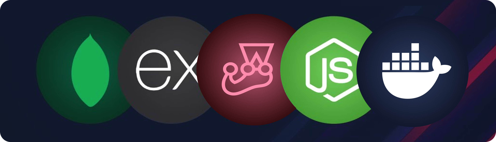

<h1 align="center">Vidly</h1>

<p align="center">
  Your one-stop solution for managing movie rentals and more.
</p>

<a href="">
   <p align=center>
    
  <p>
</a>

<div align= "center">

[](https://twitter.com/KadlagAkash) &nbsp; [](https://www.linkedin.com/in/kadlagakash/) &nbsp; [](mailto:akashkadlag14@gmail.com) &nbsp; [](https://conventionalcommits.org)&nbsp; [](https://choosealicense.com/licenses/mit/)

</div>

<h2 align="center">

[📑&nbsp; Explore API Docs](https://documenter.getpostman.com/view/31850881/2sA3Bj8Zfc)

</h2>

<br>

<p align="center">
	<a href="#features"><strong>Features</strong></a> 
	·&nbsp;<a href="#tech-stack"><strong>Tech Stack</strong></a>
   ·&nbsp;<a href="#quick-start"><strong>Quick Start</strong></a> 
	·&nbsp;<a href="#manual-setup"><strong>Manual Setup</strong></a> 
	·&nbsp;<a href="#testing"><strong>Testing</strong></a> 
</p>
<br>

## <a name="introduction">❄️&nbsp; Introduction</a>

This repository contains the backend logic for the Vidly application, which manages movie rentals, customer data, employee authentication, and more.

Dive into the codebase to explore the inner workings of Vidly's backend.

<br>

## <a name="features">🔋&nbsp; Features</a>

- **File Structure**: Organized for easy maintenance.

- **MVC Architecture**: Structured following MVC pattern for clarity.

- **MongoDB Transactions**: Ensuring data integrity.

- **Authentication & Authorization**: JWT-based authentication and role-based authorization.

- **Production Middlewares**: Integrated for security and performance.

- **Rate Limiting**: Implemented to prevent abuse and ensure fairness.

- **Testing**: Robust unit and integration tests.

- **Containerized Server**: Dockerized for easy deployment.

- **Quick Start with Docker Compose**: Hassle-free setup.

- **Custom Logger**: Detailed logging for monitoring.

- **API Docs**: Comprehensive API Docs for easy integration.

- **Best Practices**: Followed industry standards for clean, efficient code.
  <br><br>

## <a name="tech-stack">⚙️&nbsp; Tech Stack</a>

- [Node.js](https://nodejs.org/en) - JavaScript runtime
- [Express](https://expressjs.com/) – Web application framework
- [MongoDB](https://www.mongodb.com/) – NoSQL database
- [Mongoose](https://mongoosejs.com/) – MongoDB object modeling
- [RESTful API](https://restfulapi.net/) – API design principles
- [Postman](https://www.postman.com/) - API testing and documentation
- [Jest](https://jestjs.io/) – JavaScript Testing Framework
- [Git](https://git-scm.com/) – versioning
- [Docker](https://www.docker.com/) - Containerization platform
  <br><br>

## <a name="quick-start"> 🐳&nbsp;&nbsp; Quick Start</a>
0. **Prerequisites**

   Make sure you have the [Docker](https://www.docker.com/) installed on your machine.

1. **Clone the repository:**

   ```bash
   git clone https://github.com/KadlagAkash/vidly-api-node.git
   ```

2. **Navigate to the project directory:**

   ```bash
   cd vidly-api-node
   ```

3. **Start the server using Docker Compose:**

   ```bash
   docker-compose up -d
   ```

<br><br>

## <a name="manual-setup"> 🖥️&nbsp;&nbsp; Manual Setup</a>

0. **Prerequisites** <br>
   Make sure you have the following installed on your machine:

  	- [Git](https://git-scm.com/)
  	- [Node.js](https://nodejs.org/en)
   	- [npm](https://www.npmjs.com/) 
  	- [Docker](https://www.docker.com/)
  	- [MongoDB](https://www.mongodb.com/)
  		- running locally or
  		- accessible via connection URI or 
  		- running in docker container
  	- [MongoDB Compass](https://www.mongodb.com/products/tools/compass) (optional)


1. **Clone the repository:**

   ```bash
   git clone https://github.com/KadlagAkash/vidly-api-node.git
   ```

2. **Navigate to the project directory:**

   ```bash
   cd vidly-api-node
   ```

3. **Install dependencies:**

   ```bash
   npm install
   ```

4. **Set up environment variables:**

	Create .env file in the root folder and copy paste the content of .env.sample. 

   ```bash
   cp .env.sample .env
   ```

	If required, add necessary credentials.

5. **Populate the Database:**

   ```bash
   npm run seed
   ```

6. **Start the server:**

   ```bash
   npm start
   ```

7. **Explore the API:**

	 Access the project APIs at the specified endpoints using [API Docs](https://documenter.getpostman.com/view/31850881/2sA3Bj8Zfc).

   <br>

## <a name="testing"> 🧪&nbsp;&nbsp; Testing</a>

To ensure reliability and stability for our end users, we have implemented unit and integration tests throughout the application.

- First run MongoDB in a Docker container using following command

   ```bash
   docker-compose -f docker-compose.test.yml up -d mongodb
   ```

### Unit Tests

- Our unit tests focus on testing individual units of code.
- To run unit tests, execute the following command:

   ```bash
   # Run unit tests
   npm run test:unit
   ```

### Integration Tests

- Integration tests ensure that different parts of the application work together correctly.
- To run integration tests, use the following command:

   ```bash
   # Run integration tests
   npm run test:integration
   ```

### Test Everything

- To run all the tset, use the following command:

   ```bash
   # Run all the tests
   npm test
   ```
   <br/>


## 🪪&nbsp;&nbsp; Licensing Information

- This project was built while following '*[The Complete Node.js Course](https://codewithmosh.com/p/the-complete-node-js-course)*' by the Mosh Hamedani.

- It is licensed under the [MIT License](./LICENSE). Feel free to learn, add upon, and share!
